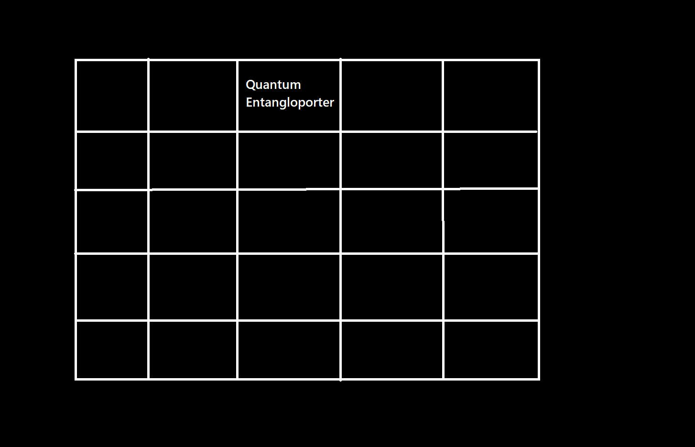

# Digital Miner Automisation with a quantum entangloporter

### Mods required: Mekanism, CC:Tweaked, PlethoraPlusOne

PlethoraPlusOne isn't a must, as the only thing it is being used for is the RF charger and the chunk loader on the turtle.
If you have other means of loading the chunk and recharging the turtle, then remove the part in the code where it places the RF charger

### Required items:
- Digital miner (with anchor upgrade)
- Advanced Turtle, with a diamond pickaxe and chunk loader upgrade
- RF charger
- 2 Quantum Entangloporters, one for energy and one for items.

## Instructions

1. Clear a room by 5Wx3Hx5L.  

2. Place the required items like this:

**Level 1**

**Level 2**

**Level 3**


3. Right-click the turtle

4. Type: lua

5. Copy and paste this below and then hit enter:

```lua
shell.run("wget https://raw.githubusercontent.com/Zeepat/CodeForDigitalMiner/refs/heads/main/miner.lua")
```

6. Exit the Turtle by typing exit(), and then press the Escape button

7. Right-click the digital miner and edit the config to mine whatever you'd like, and change the radius, max, and min to whatever you'd like.

8. Start the Digital miner.

9. Right-click the turtle.

10. Type: miner

11. Done!